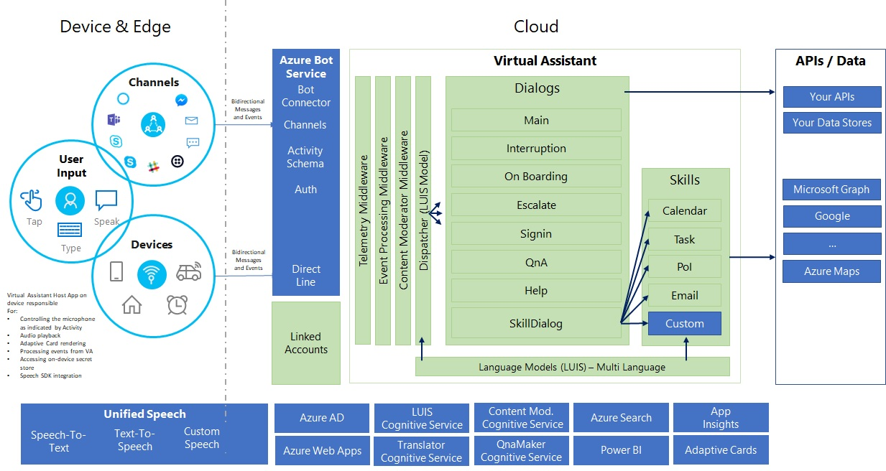

# Custom Assistant Detailed Overview

## Custom Assistant Architecture

An Architecture diagram of the Virtual Assistant is shown below.

- End-Users can make use of the Virtual Assistant through the support Azure Bot Service Channels or through the Direct Line API that provides the ability to integrate your assistant directly into a device, mobile app or any other client experience.
- Device integration requires creation of a lightweight host app that runs on the device. We have successfully built native apps across multiple platforms along with HTML5 apps. This app is responsible for the following
    - Open and closing the microphone has indicated through the InputHint on messages returned by the Assistant
    - Audio playback of responses created by the Text-to-Speech service
    - Rendering of Adaptive Cards on the device through a broad range of Renderers supplied with the Adaptive Cards SDK
    - Processing events received from the Assistant, often to perform on device operations (e.g. change navigation destination)
    - Accessing the on-device secret store to store and retrieve a token for communication with the assistant
    - Integration with the Unified Speech SDK where on-device speech capabilities are required
- The Assistant makes use of a number of Middleware Components to process incoming messages
    - Telemetry Middleware leverages Application Insights to store telemetry for incoming messages, LUIS evaluation and QNA activities. PowerBI can then use this data to surface conversational insights.
    Event Processing Middleware processes events sent by the device
    Content Moderator Middleware uses the Content Moderator Cognitive Service to detect inappropriate / PII content
    The Dispatcher is trained on a variety of Natural Language data sources to provide a unified NLU powered dispatch capability. LUIS models from the Assistant, each configured Skill and questions from QnAMaker are all ingested. THe Dispatcher then recommends the component that should handle a given utterance. When a dialog is active the Dispatcher model is only used to identify top level intents such as Cancel for interruption.
- Dialogs represent conversational topics that the Assistant can handle, the `SkillDialog` is provided with the Virtual Assistant to handle the invocation of Skills based on the Dispatcher identifying an utterance should be passed to a skill. Subsequent messages are routed to the Active dialog for processing until the dialog has ended.
- The Assistant and Skills can then make use of any APIs or Data Sources in the same way any web-page or service would do.
- Skills can request Authentication tokens for a given user when they are activated, this request is passed an event to the Assistant which then uses the Azure Bot Service authentication capability to surface an authentication request to the user if a token isn't found in the secure store.
- Linked Accounts is an example web application that shows how a user can link their Assistant to their digital properties (e.g. Office 365, Google, etc.) on a companion device (mobile phone or website). This would be done as part of the on-boarding process and avoids authentication prompts during voice scenarios.